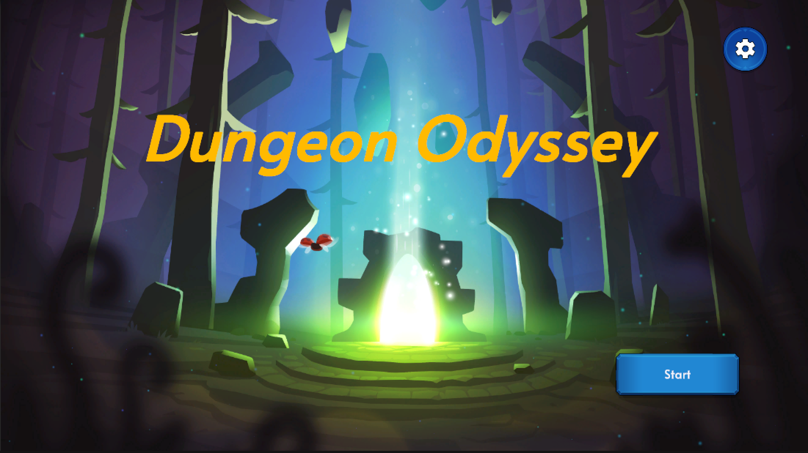
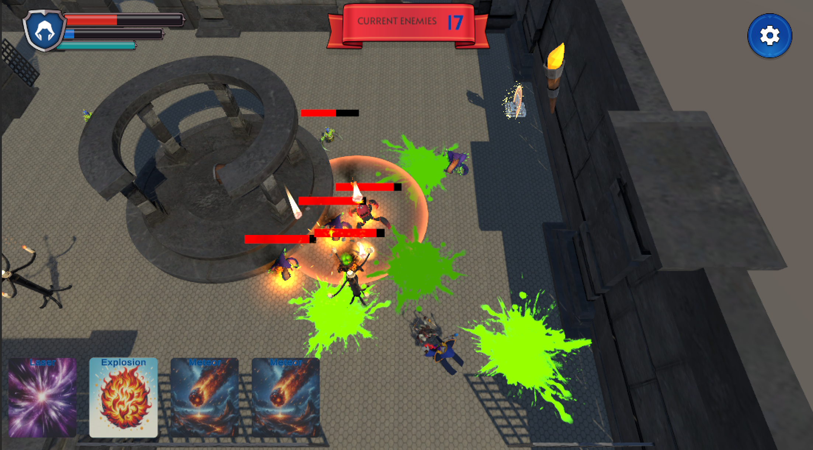
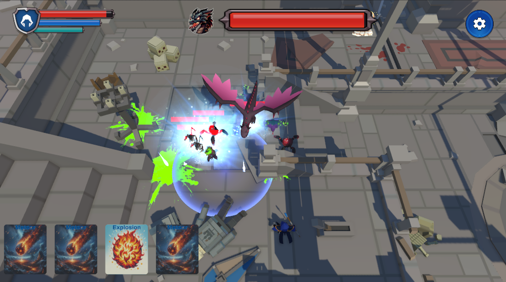

# Game-Demo

For our final project in CS6457 / CS4455 Video Game Design, we developed a dungeon-style game using Unity that features two distinct levels. Players can dash, jump, and deploy various skills, each having a unique effect on enemies. To win, players must defeat the formidable evil dragon that guards the final stage.

### Screenshots

